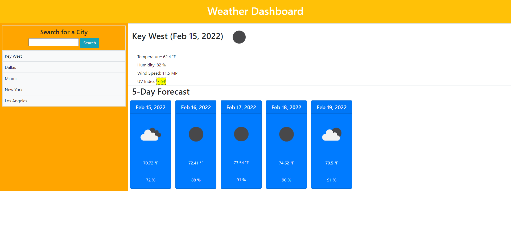

       __    __           _   _                   ___                            _   
      / / /\ \ \___  __ _| |_| |__   ___ _ __    / __\__  _ __ ___  ___ __ _ ___| |_ 
      \ \/  \/ / _ \/ _` | __| '_ \ / _ \ '__|  / _\/ _ \| '__/ _ \/ __/ _` / __| __|
       \  /\  /  __/ (_| | |_| | | |  __/ |    / / | (_) | | |  __/ (_| (_| \__ \ |_ 
        \/  \/ \___|\__,_|\__|_| |_|\___|_|    \/   \___/|_|  \___|\___\__,_|___/\__|
                                                                               
## Description
A Website application where Users are able to type in a city of their liking and then are prompted with a forecast of chosen city for the upcoming 5 days. Useful information such as estimated temperatures, weather conditions, humidity, wind speed & the UV Index are displayed for those days. Users are also shown icons that are respective to those weather conditions. Feature addition of localStorage where User is able to reselect one of their previous five searches and are able to review those weather conditions.

Coded from scratch with HTML, CSS & JS with additions of moment.JS, jQuery & Bootstrap. OpenWeather API was also integrated.

## Usage & Screenshot
- User who is looking forward to travelling to a city and would like to know what the estimated weather forecast will be when visiting in said city.

- Deployed Web Application: [Weather-Forecast](https://miguelmulet.github.io/Weather_Forecast/)

- Screenshot:

